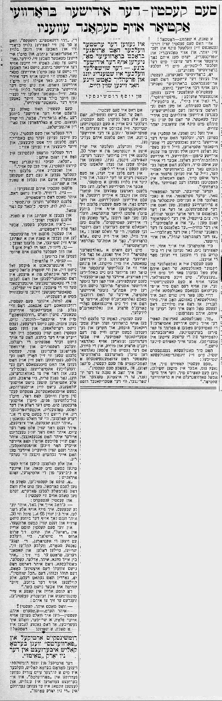

#  -- der Yidisher Brodvai actior auf second avenue

This article was published in the [_Forverts_ on 1936-04-17](https://www.nli.org.il/en/newspapers/frw/1936/04/17/01/article/28) as part of a series of articles that Joseph Rumshinsky wrote about actors in the Yiddish Theater.

#  -- the Yiddish Broadway actor on Second Avenue

_By Joseph Rumshinsky_

> He was the first to bring Broadway sensibility to the Yiddish stage. -- The actor who is always young and joyful even though his hair is already white.

:::: {.columns}

::: {.column width="50%"}

A dance, a jump - _that's all_!

That's how  has danced his way through his little world for 65 years, and in his dancing and jumping on Second Avenue, people see him move with the same ease as you'd expect to see on the Broadway stage.

Yes, from Broadway.  was the first to bring a Broadway sensibility to the Yiddish stage. His couplets included _"Fifty-fifty"_, _"The line is busy_", _"A mistake"_. He felt that we needed to attract an English-speaking audience to the Yiddish stage. He already felt this way 70 years ago.

I don't mean to say that  was someone who copied American actors, because his best roles were all true Jewish types - _chasidishe_, enthusiastically-Jewish characters, but the Jewish East Side^[Lower East Side, NYC] which has yearned for Broadway comedians because they are strangers to the East Side, has long seen  as a comedian "a là Broadway."

Every writer, composer, sculptor, follows a well-known artist from an earlier era. In the art world, people say that someone belongs to such-and-such school. For example in the literary world, people say, "He is a classical writer." In the music world, "he belongs to the Wagner school." In the painting world, "he belongs to the Rembrandt school," and so on and so forth.

Actors too have schools. They don't copy, but follow in someone else's the footsteps.  takes after . He always imitates 's little dances and their little idiosyncracies, but in a -esque sort of way.  himself actually pointed this out - three days before his death, I went to visit , and feeling like this was perhaps the last time I would speak to him, I asked:

"Mr. , why don't Yiddish actors copy you? Comedians try to imitate [Bernstein](https://www.museumoffamilyhistory.com/yt/lex/B/bernstein-berl.htm), Torenberen^[I am unable to find a reference for this person: טאָרענבערען] (a comedian from the earliest days in America). But nobody imitates you."

 answered my quietly, with his  smile, " does, and so very well. But when  copies me, I suddenly transform into a Broadway actor."

And that's who  is.

When he isn't performing, you can see him out and about in his "-esque" manner. His goal is to attract the American youth to the Yiddish theater, and in this he was once successful. My son - now a 30-year-old grown man - used to imitate  - he'd talk like him, sing like him, walk, dance, and even eat and sleep with 's songs on his lips. And my child was only one of many such children.

But it was in _chasidishe_ roles where actors would dance in quartets and sing little Jewish duets - real Jewish "kugel duets"^[קוגעל–דועטעל] - and in the days when  would appear on stage with the old [Lazer Zuckerman](https://archive.nyu.edu/handle/2451/55820), who has been referred to as "The Father of Yiddish Comedians," could you really see 's true essence. As he used to say, "If I wanted to, I could stop acting _a là Broadway_ and be a real "Goldfaden-actor"^[i.e., thoroughly Yiddish, not American]. What I mean by "Goldfaden-actor" is - my opinion after many years of experience in the Yiddish theater is that just a serious English-language actor can't truly come into his own until he performs Shakespeare, neither can an authentic Yiddish actor truly be a good actor until he has mastered the Goldfaden school and absorbed Goldfaden's prose and songs.

:::

::: {.column width="5%"}

:::

::: {.column width="45%"}

:::

::::

Though he ran to Broadway to see every American play and listen to and learn by heart almost every joke from American comedians,  was raised on Goldfaden's prose and music.  is himself a blend of the old Goldfaden and the modern Broadway theater. You could say he's of the " era."

And I have a gripe with the youth, to today's dancers and jumpers - or as the Americans call them, _"the jumping jacks"_ - who follow only the Broadway style and have unfortunately nothing to do with the Yiddish theater, even though they are on the Yiddish stage. Not only are they totally divorced from the Yiddish stage even while appearing on it, they aren't even interested in Yiddish writing or the Yiddish press, except to check on Fridays if their picture is featured on the "theater page."

 indeed brought _"a là Broadway"_ to the Yiddish stage, but as mentioned, from behind the Goldfaden and Gordin curtain.

David Kessler and  were very good friends and used to _kibbitz_, and their _kibbitzing_ would go something like this^[Read Sam's version of this [in his memoirs](https://sjspielman.github.io/sam-kasten-memoirs/chapters/36_1947-01-18.html)]:

David Kessler would meet  in the street and say to him:

"Hello, Kasey (his nickname for ). I can do it too." And in the same breath, David Kessler would put his walking stick under his arm do a little dance and a jump.

 would answer him, "No, David, that's not it. You're making it too dramatic." 

Kessler would become serious: "_Look_, _look_, Kasey. I'll do it again." And he'd do a jump and a dance.

 would say, "That's a little bit better, but still too dramatic." And then  would position himself to dance and jump in his own way, and he'd say: "_Nu, David, how do you like it_?"

And David Kessler would hug him and grumble, "_Kasey, you're alright!_"

No matter how interesting or strong a play might be, the lives of actors are always more interesting than the roles they play. They really are engimas.

Our dear , for example. He made it through the early days, the cradle of the Yiddish theater. And by "made it through," I mean he toiled through hunger, suffering, a penniless existence, days of nothing to eat, and sleepless nights. When he finally made a career for himself on the stage, he didn't follow the norms that the doctors and private citizens alike preach.  ate whatever his heart desired, drank whatever his eyes could see, and immersed himself in the typical actor's nightlife. Yet admirably, every morning at rehearsals when the other actors would show up completely exhausted after a sleepness night,  stood tall with his white head of hair and full-blooded face and neatly pressed suit with script in hand, dancing and jumping. He would tease his colleagues, saying "You punks, you young rascals... you've finished before you've even gotten started! You have your "shoulders on your heads"^[perhaps an inverse idiom of "good head on your shoulders" as a charming insult] before your hair is even grown out. You're hoarse before we've even heard you sing properly."

And everyone would look at  almost with envy, and the _kibbitzers_ among them would say ironically, "Oh sure, look at . You do everything you're supposed to you, and you end up looking like him!"

And  would answer, "I'll have you know, you little punks, I do everything I'm supposed to. I'm 65 but I feel like 30. You're not even up on the stage yet, and still you're on your way down."

And when  would come around the Cafe Royal and look around the tables where all the actors sat and the so-called stars gathered, screaming and divvying up roles and doling out orders. He would think to himself, "I'm jealous of you - Adler, Kessler, Mogulesko - who don't have to see the chaos of today, this _toho va'boho_^[chaos; this is a Biblical phrase in Genesis describing the chaos before the creation of light], this _hakol shochtin_^[Talmudic phrase technically provisioning that anyone who can perform kosher slaughter is permitted to do so]. Yes, Gordin was right: Everyone slaughters on the stage, but none of the slaughter is kosher. 

If a journalist entered the cafe, upon seeing  he would say, "How are you, ?"

And  would reply, "If I were in your place, a writer, I would write that all of life is a dance, a jump - _that's all_!"

